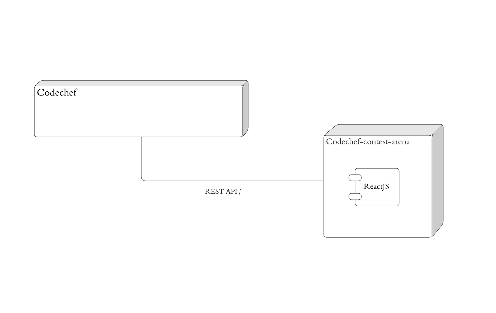
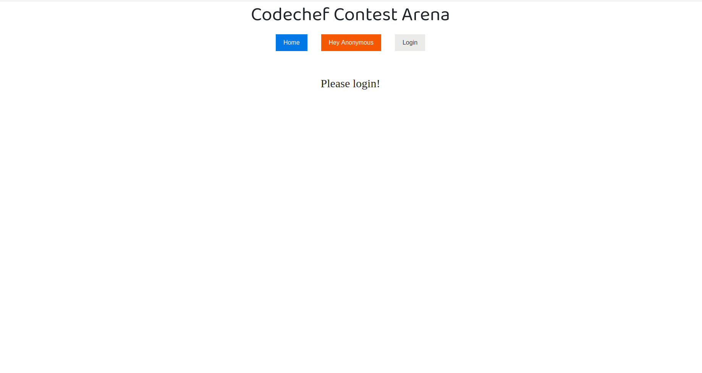
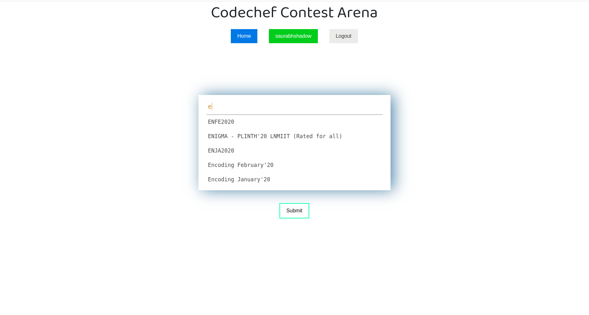
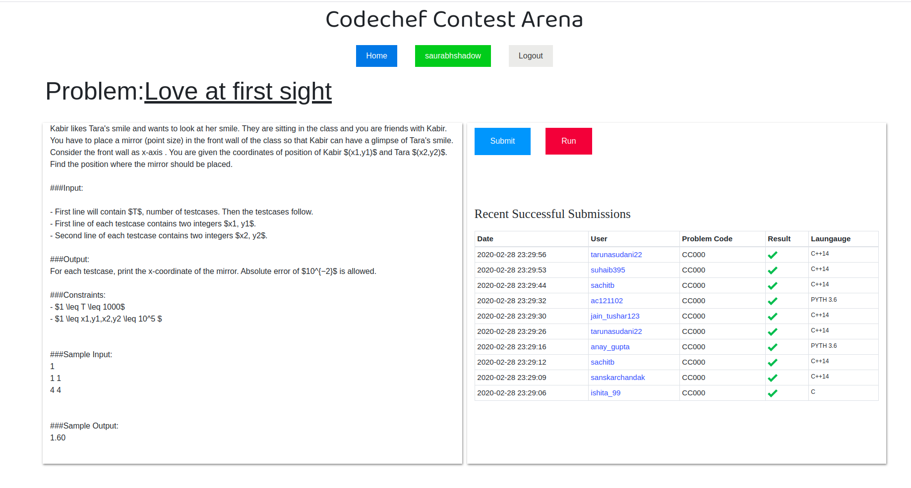
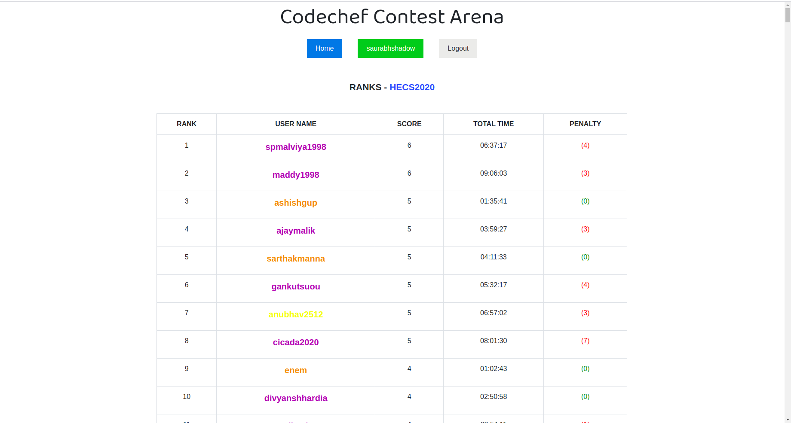

<h1 align="center">Codechef-Contest-Arena</h1>

## About
The app is designed to simulate **Codechef's past contest**. Here are the main functionality of app:
- You can login using your Codechef's account(using the CodeChef API OAuth2)
- Once you logged in there is an auto-complete box that will accept a Contest Code or a Contest Name, that will take you to the contest problem page
- Contest page have functionality like:
  - A clickable list of problems
  - Recent activity of users on the contest (submission information)
  - The ranklist for the contest.
  - Timer
- Problem page have functionality like:
  - The Problem Statement
  - Successful submissions information on the problem
  - A Submit Section
 
### How to run the app?
- The application was deployed on a [public url](https://modest-carson-21aa1e.netlify.com/) with the help Netlify's cloud.
- To test the app locally:
  - `git clone https://github.com/saurabhshadow/Codechef-contest-arena.git`
  - `cd Codechef-contest-arena`
  - update **config-dev.json**.
  - run `npm install`
  - run `npm start`

- **Functions Description**
  - Login with Codechef - You can login using your Codechef's account which uses the CodeChef API OAuth.
  - Choose Contest - You can choose any contest whether by its name or code. The autocomplete box will accept a Contest Code or a Contest Name, that will take you to the contest page, which consists of list of clickable problems, recent submission, timer and rank list
  - Ranklist - Shows the ranklist of the selected contest.
  - Timer - Contest run for a period of given duration and once the contest gets over it automatically moves to the home page.
 
 
 
 
### App Architecture
The application uses 2 components:
- Frontend
- Codechef API
 

 
 
 
### Application Screenshots

Login        |  After login
:-------------------------:|:-------------------------:
 | 

Contest Page        |   Problem Page
:-------------------------:|:-------------------------:
 | 

Rank-list             | 
:-------------------------:|
 | 

### Difficulties faced during development
- I was never much introduce to development field(except some basics of DJANGO), so it took 4-5 days in learning the concepts of React, authorization with Oauth2 and working with API. Making Login with CodeChef Credentials (using the CodeChef API OAuth) was one of the difficult part. 

### Technologies used:-
- React
- Javascript
- Codechef API
- Bootstrap v3
- Reactstrap
- Netlify(a cloud computing company)

#### Public URL of application can be found [here](https://modest-carson-21aa1e.netlify.com/)

 Made with ❤ by <a href="https://github.com/saurabhshadow">Saurabh Yadav</a>

